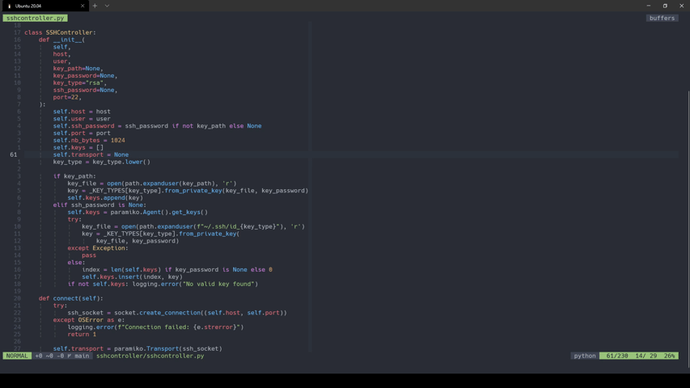

# nvim-lspfuzzy

This plugin makes the Neovim LSP client use
[FZF](https://github.com/junegunn/fzf) to display results and navigate the code.

It works by redefining LSP handlers so that they call FZF. Therefore you don't
need to change any of your exising LSP mappings. It's also **small** (currently
at ~230 SLOC) and **written entirely in Lua**.

The plugin is compatible only with Neovim 0.5+.



## Installation

#### With Packer
```lua
use {
  'ojroques/nvim-lspfuzzy',
  requires = {
    {'junegunn/fzf'},
    {'junegunn/fzf.vim'},  -- to enable preview (optional)
  },
}
```

#### With Plug
```vim
Plug 'junegunn/fzf', {'do': {-> fzf#install()}}
Plug 'junegunn/fzf.vim'  " to enable preview (optional)
Plug 'ojroques/nvim-lspfuzzy'
```

## Usage
Simply add this line to your *init.lua*:
```lua
require('lspfuzzy').setup {}
```

If you're using a *.vimrc* or *init.vim*:
```vim
lua require('lspfuzzy').setup {}
```

In addition, the plugin creates the following commands:
* `:LspDiagnostics <bufnr>`: list diagnostics from given buffer (use `0` for
  current buffer)
* `:LspDiagnosticsAll`: list diagnostics from all buffers

By default the following FZF actions are available:
* <kbd>**tab**</kbd> : select multiple entries
* <kbd>**shift+tab**</kbd> : deselect an entry
* <kbd>**ctrl-a**</kbd> : select all entries
* <kbd>**ctrl-d**</kbd> : deselect all entries
* <kbd>**ctrl-t**</kbd> : go to location in a new tab
* <kbd>**ctrl-v**</kbd> : go to location in a vertical split
* <kbd>**ctrl-x**</kbd> : go to location in a horizontal split

## Configuration
You can pass options to the `setup()` function. Here are all available options
with their default settings:
```lua
require('lspfuzzy').setup {
  methods = 'all',         -- either 'all' or a list of LSP methods (see below)
  fzf_preview = {          -- arguments to the FZF '--preview-window' option
    'right:+{2}-/2'          -- preview on the right and centered on entry
  },
  fzf_action = {           -- FZF actions
    ['ctrl-t'] = 'tabedit',  -- go to location in a new tab
    ['ctrl-v'] = 'vsplit',   -- go to location in a vertical split
    ['ctrl-x'] = 'split',    -- go to location in a horizontal split
  },
  fzf_modifier = ':~:.',   -- format FZF entries, see |filename-modifiers|
  fzf_trim = true,         -- trim FZF entries
}
```

The `fzf_preview` and `fzf_action` settings are determined as follows:
1. Values passed to `setup()` are used first.
2. Otherwise the plugin will try to load values from the respective FZF options
   `g:fzf_preview_window` and `g:fzf_action` if they are set.
3. Finally the default values will be used.

For others FZF options such as `g:fzf_layout` or `g:fzf_colors` the plugin will
respect your settings.

## Supported LSP methods
You can enable FZF only for some LSP methods by passing them as a list to the
`methods` option when calling `setup()`. The supported LSP methods are:
```
callHierarchy/incomingCalls
callHierarchy/outgoingCalls
textDocument/codeAction
textDocument/declaration
textDocument/definition
textDocument/documentSymbol
textDocument/implementation
textDocument/references
textDocument/typeDefinition
workspace/symbol
```

## Troubleshooting

#### Preview does not work
You need to install [fzf.vim](https://github.com/junegunn/fzf.vim) to enable
previews. If it's already installed, make sure it's up-to-date. The plugin
checks that `g:loaded_fzf_vim` is set, which was introduced
[in this commit](https://github.com/junegunn/fzf.vim/commit/636a62f140181f80c8e7460a76ae6a5d2c5d97b2).

#### Preview does not scroll to the selected location
Try to append `+{2}-/2` to either `g:fzf_preview_window` or to the `fzf_preview`
option in `setup()` to make the preview respect line numbers. For instance:
```lua
vim.g.fzf_preview_window = {'down:+{2}-/2'}
```

#### Using the `fzf_modifier` option breaks the plugin
The plugin uses the filename embedded in the FZF entry selected by the user to
jump to the correct location. Therefore it must resolve to a valid path. For
instance `:.` or `:p` can be used but not `:t`.

## License
[LICENSE](./LICENSE)
